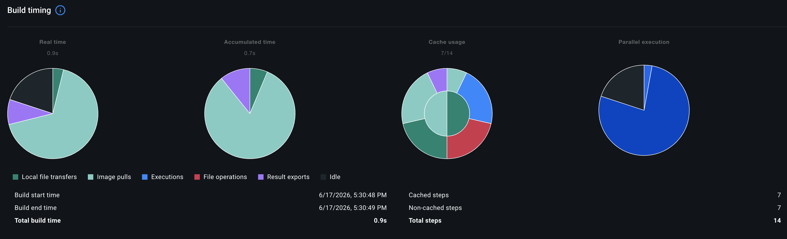
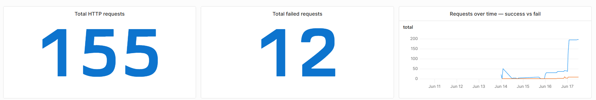
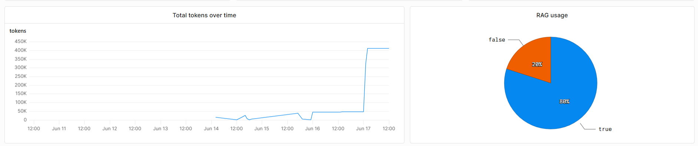
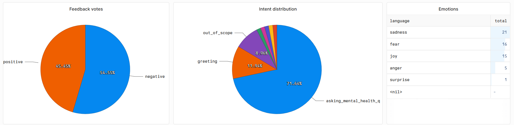
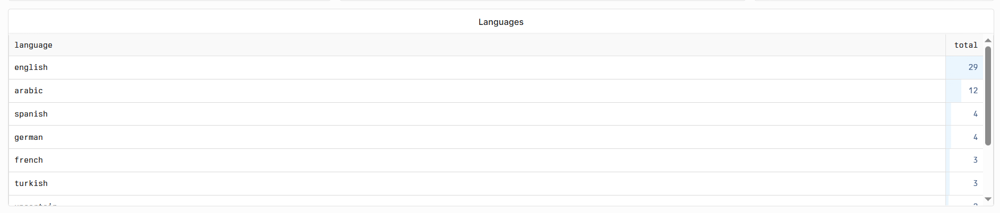

# Mental Health Support Chatbot (RAG-Based)

An AI-powered chatbot that provides mental health support using Retrieval-Augmented Generation (RAG). The system understands user intent, detects emotions, supports multiple languages, and retrieves relevant counseling responses from a vector database.

## Features

- **Multilingual Support**: Detects and translates 20+ languages
- **Intent Classification**: Distinguishes between greetings, questions, gratitude, and out-of-scope requests
- **Emotion Detection**: Classifies user emotions into 6 classes (sadness, joy, love, anger, fear, surprise)
- **RAG Pipeline**: Retrieves relevant mental health counseling responses from a vector database
- **Response Summarization**: Optionally summarizes long retrieved contexts
- **Session Management**: Maintains conversation history using Redis
- **Language Flexibility**: Translates user queries to English, processes them, and translates responses back

## Tech Stack

- **Backend**: FastAPI
- **Vector DB**: Qdrant (cloud-hosted)
- **Embeddings**: BAAI/bge-large-en-v1.5 (Hugging Face)
- **LLMs** (via Groq):
  - **Response generation, translation, summarization**: `meta-llama/llama-4-scout-17b-16e-instruct` (larger model for higher-quality output)
  - **Intent classification**: `llama-3.1-8b-instant` — a separate, **lighter model** dedicated to the intent classifier, since intent labeling is a simpler task that doesn't need the larger model's capacity. This keeps classification fast and cheap while reserving the heavier model for the user-facing responses.
- **Cache**: Redis
- **ML Models**: DistilBERT (emotion), Linear SVC (language detection)
- **Observability**: OpenTelemetry (traces, metrics, logs) exported via OTLP/HTTP to [Axiom](https://axiom.co)

## Project Structure

```
Backend/                          # Application root (run the server from here)
├── main.py                       # FastAPI app entry point (lifespan + router wiring)
├── ENUMS/                        # Shared enums (languages, intents)
├── rag/
│   ├── generator.py              # Main response generation pipeline
│   ├── retriever.py              # Vector DB retrieval + cross-encoder reranking
│   ├── store_ds_in_vector_db.py  # Embed & upload the dataset to Qdrant
│   ├── preprocess_csv.py         # Dataset preprocessing
│   ├── get_data_locally.py       # Local dataset download helper
│   └── helper_models/
│       ├── emotion_classifier/   # DistilBERT emotion classifier
│       ├── language_detector/    # Linear SVC language detector
│       ├── intent_classifier/    # Intent classifier
│       ├── llm_caller/           # Groq LLM wrapper (response, translate, summarize, intent)
│       ├── Preprocessor/         # Text preprocessing utilities
│       ├── model_objs/           # Saved model artifacts (.pkl)
│       └── prompts/              # Prompt templates (intent, translator, summarizer)
├── deployment/                   # FastAPI app package (run from project root)
│   ├── routes/                   # API endpoints (base, generation, health)
│   ├── controllers/              # Session & chat history management (Redis)
│   └── models/                   # Request/response schemas (Pydantic)
└── Notebooks/                    # Model training & experimentation notebooks
    ├── EmotionClassifierModel/   # DistilBERT emotion model training
    ├── LanguageDetectorModel/    # Language detection model training
    ├── IntentClassification/     # Intent classification experiments
    └── RAG Notebook/             # Retrieval + embedding experiments
```

## Setup

### 1. Install Dependencies
```bash
pip install -r requirements.txt
```

### 2. Configure Environment
Copy `.env.example` to `.env` and fill in:
```bash
# ── Qdrant (vector DB) ──
QDRANT_CLUSTER_ENDPOINT=your_qdrant_url
QDRANT_API_KEY=your_api_key
EMBEDDINGS_COLLECTION_NAME=mental_health
EMBEDDING_MODEL=BAAI/bge-large-en-v1.5
RERANKING_MODEL=cross-encoder/stsb-roberta-base
TOP_K=1
TOP_R=10

# ── LLMs (Groq) — intent uses a lighter model than the rest ──
GROQ_API_KEY=your_api_key
SIDE_MODEL=meta-llama/llama-4-scout-17b-16e-instruct   # response, translation, summarization
INTENT_CLASSIFICATION_MODEL=llama-3.1-8b-instant       # lighter model for intent only

# Retrieval summarization — set to false to skip the summarizer LLM call
# and pass raw retrieved references straight to the response generator
SUMMARIZE_RETRIEVALS=true

# ── Session management (Redis) ──
REDIS_HOST=localhost
REDIS_PORT=6380
MAX_MESSAGES=10
TTL_SECONDS=3600

# ── Local model paths (auto-downloaded from HuggingFace if not found) ──
LANGUAGE_DETECTION_MODEL_PATH=your-path
EMOTION_MODEL_PATH=your-path

# ── Observability (OpenTelemetry → Axiom) ──
AXIOM_API_TOKEN=your_axiom_api_token
AXIOM_DATASET=mental-health-rag-otel
```

> **Model auto-download:** If the file at `LANGUAGE_DETECTION_MODEL_PATH` or `EMOTION_MODEL_PATH` does not exist locally, it is automatically downloaded from HuggingFace Hub ([`Abdellmohsennn/language_detector`](https://huggingface.co/Abdellmohsennn/language_detector) and [`Abdellmohsennn/final_mental_emotion_model`](https://huggingface.co/Abdellmohsennn/final_mental_emotion_model) respectively) and saved to the configured path. Make sure the parent directory exists and is writable.

### 3. Start Services
```bash
# Terminal 1: Redis (for session history)
redis-server --port 6380

# Terminal 2: FastAPI server (entry point lives in Backend/)
cd Backend && python main.py
```

## API Usage

The backend is deployed on Hugging Face Spaces:

**Base URL:** `https://abdellmohsennn-mental-assistance-app.hf.space`

| Method | Endpoint   | Description                          |
|--------|------------|--------------------------------------|
| `GET`  | `/`        | Service info (app name & version)    |
| `GET`  | `/health/` | Health check                         |
| `POST` | `/chat`    | Main chat endpoint (rate limit: 7/min) |
| `POST` | `/feedback`| Submit thumbs up/down feedback       |

### Chat
```bash
POST /chat
Content-Type: application/json

{
  "query": "I'm feeling anxious",
  "session_id": "optional-uuid"
}
```

**Response:**
```json
{
  "answer": "Here are some strategies for managing anxiety...",
  "session_id": "uuid"
}
```

**Example (cURL):**
```bash
curl -X POST https://abdellmohsennn-mental-assistance-app.hf.space/chat \
  -H "Content-Type: application/json" \
  -d '{"query": "I feel anxious all the time"}'
```

> Pass the `session_id` returned by the first call back in subsequent requests to
> keep conversation history (stored in Redis). Omit it to start a new session.

> **Rate limiting:** the `/chat` endpoint is rate-limited to **7 requests/minute per IP**
> (via `slowapi`) to protect the backend from abuse. Exceeding the limit returns `429 Too Many Requests`.

## How It Works

1. **Language Detection**: Identifies user's language; translates to English if needed
2. **Intent Classification**: Determines if user is asking a question, greeting, expressing gratitude, etc.
3. **Emotion Detection**: Classifies emotional state for context-aware responses
4. **RAG Retrieval**: Searches vector DB for top-K relevant counseling responses (only for mental health questions)
5. **Response Generation**: Uses the response LLM with retrieved context to generate a personalized response
6. **Translation**: Translates response back to user's original language
7. **History Storage**: Saves conversation in Redis for session continuity

## Emotion Labels

The emotion classifier predicts one of 6 classes, with the following numerical mappings:

| Label | Emotion  |
|-------|----------|
| 0     | Sadness  |
| 1     | Joy      |
| 2     | Love     |
| 3     | Anger    |
| 4     | Fear     |
| 5     | Surprise |

## Model Downloads

The language-detection and emotion models are **downloaded automatically from HuggingFace Hub**
at startup if not present locally (see the note in *Configure Environment*). Mirror copies:

- HuggingFace: [`Abdellmohsennn/language_detector`](https://huggingface.co/Abdellmohsennn/language_detector), [`Abdellmohsennn/final_mental_emotion_model`](https://huggingface.co/Abdellmohsennn/final_mental_emotion_model)
- Google Drive: [Language Detection Model](https://drive.google.com/file/d/1XHIuYFL-ogLVQFL2bFIoAEPTM2WrsGar/view?usp=drive_link), [Emotion Detection Model](https://drive.google.com/drive/folders/1yxoEbYlZ7TmfWgc8HAysyt6lssGXzhHT?usp=sharing)

## Performance

- **Language Detection**: 99.57% accuracy across 20 languages
- **Intent Classification**: Highly accurate on mental health domain
- **Response Quality**: Context-aware, empathetic responses grounded in real counseling data

## Deployment
- **Frontend**: [frontend_link](https://aliabdelmonam.github.io/chatbot-frontend/)
- **Backend**: [backend_link](https://abdellmohsennn-mental-assistance-app.hf.space)

### CI/CD Pipeline
On every push to the deployment branch, GitHub Actions
([`.github/workflows/actions.yaml`](.github/workflows/actions.yaml)):
1. **Tests** — runs the `pytest` suite with coverage
2. **Builds & pushes** the Docker image to DockerHub (`mental-health-app:latest`)
3. **Deploys** by pointing the HuggingFace Space at the freshly published image and triggering a rebuild

### Docker Image Layer Caching

The Docker build is optimized so unchanged layers (base image, dependency installs)
are reused across builds instead of rebuilt. In the verification below, **7 of 14
layers were cache hits** (7 cached / 7 non-cached), dropping the total build time to
**~0.9s** when nothing relevant changed:



### Metrics used in Axiom Dashboard

| # | Metric | Category | Why it matters |
|---|--------|----------|----------------|
| 1 | Total HTTP Requests | Server | Baseline pulse of the app; reveals traffic patterns and when load is highest |
| 2 | Failed HTTP Requests (`5xx`) | Server | Catches broken deploys or lagging `Qdrant`/`Redis` before users notice |
| 3 | Response Latency (`p95`/`p99`) | Server | Keeps replies fluid; a lagging bot feels detached and uncaring |
| 4 | Intent Distribution | Model / NLP | Shows what users want; spikes in `out_of_scope` flag dataset gaps |
| 5 | RAG Pipeline Activity | Model / NLP | Tracks whether answers are grounded in the vetted DB (`used=true`) vs. freestyled |
| 6 | Emotional Trends | Model / NLP | Tailors bot tone; sanity-checks the emotion classifier |
| 7 | Language Distribution | Model / NLP | Reveals where the translation pipeline works hardest |
| 8 | Total Token Consumption | Data | Financial early-warning system for runaway prompt/context cost |
| 9 | User Feedback (👍/👎) | Data | The ultimate truth-teller — shows when the tech is failing the human |

> 📖 For the full rationale behind each metric, see [METRICS.MD](METRICS.MD).

### Axiom Dashboard








